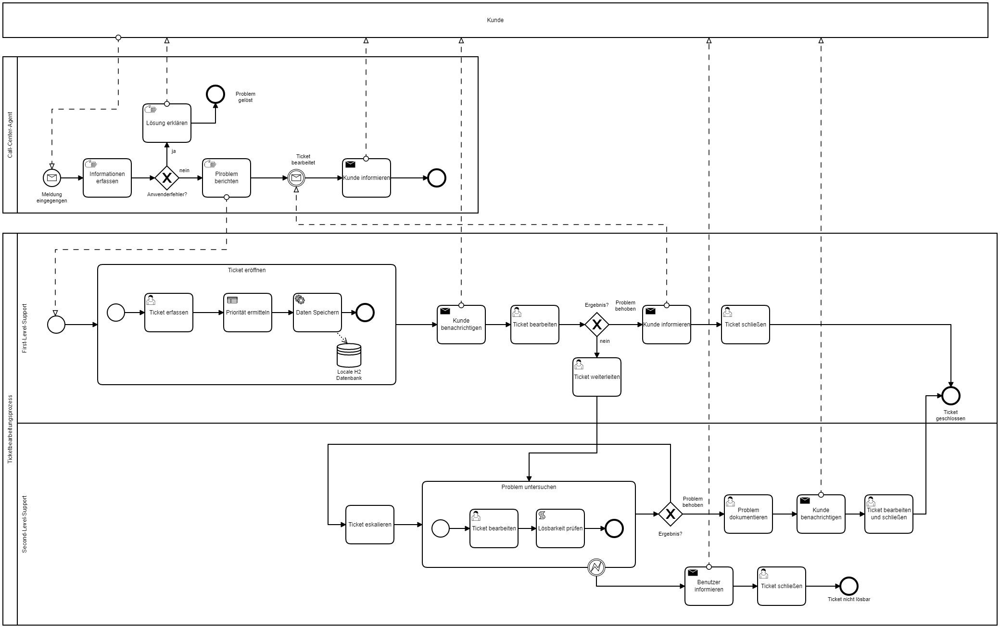

# Entwicklungsumgebung
---

- Eclipse IDE for Java Developers (Version: Oxygen.3a Release (4.7.3a))
- [Camunda BPM Tomcat 7.8.0](https://camunda.org/release/camunda-bpm/tomcat/7.8/camunda-bpm-tomcat-7.8.0.zip)
- [H2-Database Java Library (h2-1.4.197)](http://www.h2database.com/html/main.html) 


## Voraussetzung:
### H2 Tabelle erstellen:	
Im Grunde ist es nicht notwendig die Daten separat zu speichern, denn die Daten werden in der Prozessinstanz von Camunda BPM gespeichert. Dennoch werden die Daten zusätzlich in der H2 Datenbank gespeichert. Das hat den Vorteil, dass die Daten persistent gespeichert und auf die Daten individuell zugegriffen werden können. Ferner wird die H2 Datenbank für die Erzeugung der Ticket-ID verwendet. Der Befehl AUTO_INCREMENT(10000,1) führt dazu, dass er bei der Zahl 10000 beginnt und mit jedem neuen Datensatz eins hochzählt. 
 
```
CREATE TABLE SDDATA (TICKETID int(11) AUTO_INCREMENT(10000,1), Tickettyp varchar(20),user
varchar(15),prio varchar(10), title varchar(8), dat Timestamp, firstN varchar(15), lastN 
varchar(15), phoneN varchar(15),email varchar(30), description clob,PRIMARY KEY (TicketID))
````

## Einordnung des Themas in die Prozess-Landschaft (2 Punkte) 
Das Rechenzentrum (RZ) ist der zentrale IT-Dienstleister der Technischen Hochschule Brandenburg. Es stellt der Hochschule ein breites Spektrum an Dienstleistungen aus den Bereichen Rechen- und Datendienste, Kommunikation sowie Anwendungen und Prozessunterstützungen zur Verfügung. Neben Basisdienstleistungen wie Email-Server, Datennetz, Telefonnetz, WLAN stellt das RZ eine Virtuell Desktop Infrastucture (VDI) zur Verfügung. Die steigende Komplexität der IT-Dienste des RZ und die steigende Anzahl von Anfragen von Studierenden, Instituten, anderen Hochschulen und Unternehmen nach den IT-Diensten des RZ, ist es unerlässlich, ein IT-Service Management (ITSM) zu etablieren. Der Service Desk ist ein Bestandteil dieses ITSM.

## Abgrenzung und Beschreibung der Prozesse und Entscheidungen (6 Punkte)

## Erläuterung fachlicher und technischer Modellierungsentscheidungen (6 Punkte)
### Pool Call-Center-Agent
Im Pool *Call-Center-Agent* versucht der Agent das Problem selbstständig zu erfassen und zu lösen. Hat er eine Lösung gefunden wird es dem Kunden direkt mitgeteilt. Ist keine Lösung zu finden, wird das Problem an den First-Level-Support berichtet. Dieser Vorgang ist manuell durchzuführen und ist somit nicht technisch in Camunda BPM implementiert.
### Pool First-Level-Support
Im Pool *First-Level-Support* wurde das *Start Event* anstelle von *Massage Start Event* verwendet, da sonst beim Starten des Prozesses, Camunda eine technische Implementierung erwartet und somit eine Fehlermeldung ausgibt. 
- Der Subprozess *Ticket eröffnen* stellt dem Benutzer erstmals ein Formular (Request.html) zur Verfügung, welches ausgefüllt werden muss. Im Anschluss wird ein Entscheidungsprozess gestartet, welches das Ticket nach Priorität (hoch, mittel, niedrig) einstuft. Die Erfassten Daten werden im nächsten Schritt in einer H2 Datenbank gespeichert. 
- In allen *Send Tasks* wurde ein Java Programm implementiert. Beim der Ausführung wird aus der H2 Datenbank die TicketID des letzten Eintrages ausgelesen und mit einer vorgefertigten Nachricht an den Kunden gesendet. Es gibt drei Varianten von Mitteilungen (Bestätigung, Problem gelöst und Problem nicht lösbar).

- Für das Erfassen und die Bearbeitung von Tickets wurde eine UserForm entwickelt. Camunda bietet die Möglichkeit embedded UserForm als HTML JavaScript und Bootstrap

## Reflexion von Schwachstellen und Optionen für Verbesserungen (3 Punkte)

## potenzielle Verknüpfungen zu anderen Prozessen (3 Punkte)


This is a link to 
